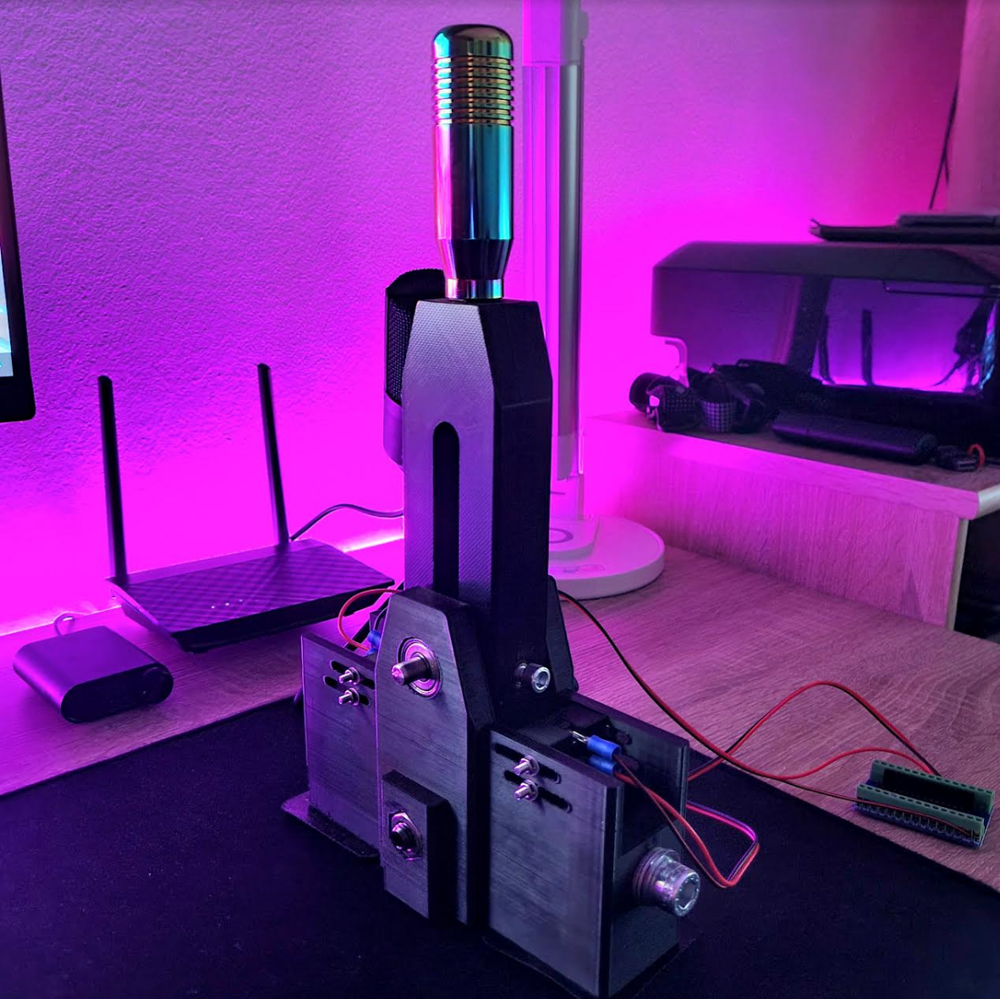

# 3D Printed Arduino Sequential Shifter

Sequential shifter is an open-source project aimed at creating a sequential shifting mechanism using Arduino, micro switches, and a 3D printer. This project allows enthusiasts to build their own sequential shifter for sim racing or other applications where sequential gear shifting is desired.

  

## Table of Contents

- [Introduction](#introduction)
- [Components Used](#components-used)
- [How It Works](#how-it-works)
- [Setup Instructions](#setup-instructions)
- [Usages](#usages)
- [Contributing](#contributing)

## Introduction

The Sequential Shifter project aims to create a simple yet effective sequential shifting mechanism using Arduino and micro switches. By utilizing 3D printed components, users can build their own sequential shifter for use in sim racing rigs or other applications.

## Components Used

The Sequential Shifter project utilizes the following components:

- Arduino Nano
- Micro switches (x2)
- 3D printed housing and lever
- Wires
- micro USB cable
- Ball bearings (608-2RS) (2x)
- Springs 
- M10x60 bolts + nuts (DIN912) (x2)
- M2.5x55 bolts + nuts (4x)
- M6x40 bolts (DIN912) (x2)
- Stainless steel shaft 8x60
- Spring plunger M8 (2x)

  

## How It Works

The sequential shifter system consists of two main components: the hardware and the software.

### Hardware

The hardware setup includes mounting the micro switches onto the 3D printed housing and connecting them to the Arduino Nano. The Arduino Nano is then connected to the computer via USB for serial communication.

  

  

### Software

The software component consists of Arduino code to read the state of the micro switches and Python code to interpret the switch states and simulate key presses. The Arduino code reads the state of the micro switches and sends serial messages indicating whether an upshift or downshift is requested. The Python code listens for these messages and simulates key presses accordingly.

## Setup Instructions

To set up the Sequential Shifter system, follow these steps:

1. Assemble the hardware components and mount them onto the 3D printed housing.
2. Upload the provided Arduino sketch onto the Arduino Nano.
3. Connect the Arduino Nano to your computer using the USB cable.
4. Install the necessary Python dependencies for serial communication.
5. Run the Python script to start listening for serial messages from the Arduino.

## Usages

Once the Sequential Shifter system is set up, users can interact with the micro switches to perform sequential gear shifts. Pressing one switch will trigger an upshift, while pressing the other will trigger a downshift.

## Contributing

Contributions to the Sequential Shifter project are welcome! If you have ideas for improvements or new features, feel free to open an issue or submit a pull request on GitHub.

This is a .md file for my GitHub project.
